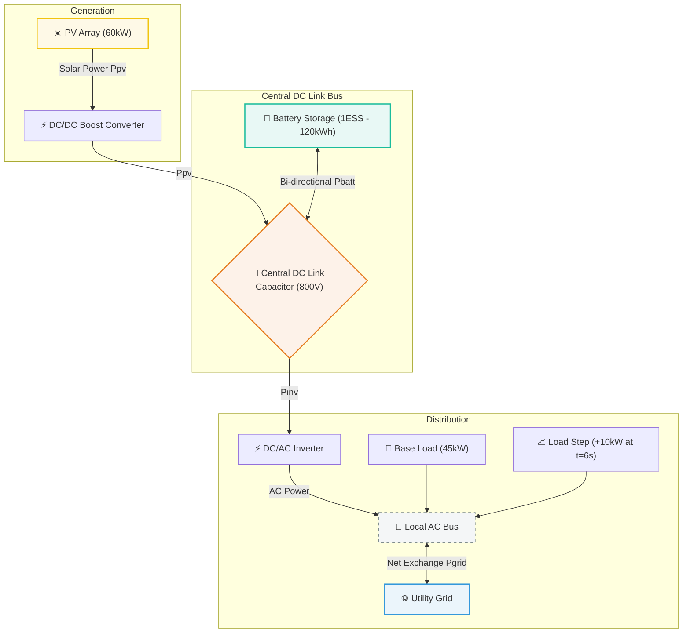
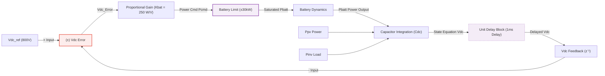

# SimuGrid Lab ⚡
### MATLAB/Simulink R2026a Power-Flow Transient Solver & Interactive Dashboard

SimuGrid Lab is a high-fidelity web-based transient solver and interactive visualization dashboard built to simulate the `build_microgrid_r2026a` Simulink power-flow model directly in the browser. 

Designed for control engineers, energy researchers, and web developers, it brings Simulink equations to life using a discrete-time ODE solver, interactive block diagram inspector, and multi-axis scoping.

---

## 📐 System Topology & Block Diagram

The microgrid system models the energy exchange between solar generation, battery storage, local loads, and the utility grid.

### 1. Power-Flow Schematic
This flowchart represents the physical power flow routing in the microgrid model:



---

### 2. Feedback Control Loop (DC Voltage Regulator)
To regulate the central DC link voltage ($V_{dc}$), a battery charge/discharge feedback controller monitors the bus voltage and controls BESS output. This flowchart represents the Simulink signal feedback path:



---

## ✨ Features

* **⚡ 1ms Discrete ODE Solver**: Solves a 10-second simulation ($10,000$ iterations) using fixed-step Euler integration in under 5ms.
* **📦 Interactive Simulink Block Inspector**: Click any block in the schematic grid to reveal its mathematical equations, theoretical explanation, and raw MATLAB Stateflow API constructor script.
* **📺 Multi-Axis scope (Oscilloscope)**: Displays high-frequency waves:
  - **Left Y-Axis (Red/Green)**: DC Link Voltage ($V_{dc}$) showing transient sags/overshoots, and Battery SOC (%).
  - **Right Y-Axis (Multicolor)**: Active power curves ($kW$) for PV, Battery, Load, and Grid.
* **⚙️ Live Parameter Tuning**: Real-time sliders allow you to sweep parameters ($K_{bat}$ loop gains, $C_{dc}$ capacitor sizes, ratings, limits, and step times) and instantly observe transient stability responses.
* **🧪 Test Suite**: Pre-integrated with a `node verify_microgrid.js` unit test suite to assert simulation physics, downsampling, and block metadata mappings.
* ** Apple India HIG Style**: A clean storefront-style light-theme layout built with token-driven styles, pill button shapes, and high contrast.

---

## 🔬 Mathematical Formulations

The solver calculates the following equations at each step ($dt = 1\text{ms}$):

1. **PV Solar power**:
   $$P_{pv}(t) = P_{pv,rated} \times \max\left(0, \min\left(1, \frac{G(t)}{1000}\right)\right)$$
   *Irradiance $G$ drops from $1000 \rightarrow 700\text{ W/m²}$ at $t=5.0\text{s}$.*

2. **DC Link Voltage Regulation**:
   $$P_{cmd} = K_{bat} \times (V_{dc,ref} - V_{dc})$$
   $$P_{batt} = \text{clamp}(P_{cmd}, -P_{bat,max}, P_{bat,max})$$
   *Uses a Unit Delay ($z^{-1}$) feedback on Vdc to prevent algebraic loops.*

3. **Capacitor State Equation**:
   $$\frac{dV_{dc}}{dt} = \frac{P_{pv} + P_{batt} - P_{load} \cdot K_{inv}}{C_{dc} \cdot V_{dc}}$$
   $$V_{dc}(t) = V_{dc}(t-dt) + dV_{dc} \cdot dt$$

4. **Grid active power balance**:
   $$P_{grid} = P_{load} - P_{pv} - P_{batt}$$

---

## 🚀 Getting Started

### 1. Run SimuGrid Lab Web Interface (Local)
Ensure you have Node.js installed, then execute:
```bash
# Install dependencies (Vite, Chart.js)
npm install

# Start the hot-reloading development server
npm run dev
```
Open **`http://localhost:5173/`** in your browser.

### 2. Run Automated Verification Tests
Validate simulation mathematics, exponential decay rates, and metadata mapping:
```bash
node verify_microgrid.js
```

### 3. Run in MATLAB R2026a (Simulink)
The repository includes the standalone script **`build_microgrid_r2026a.m`** which programmatically creates the exact Simulink model sheet using native block integrations (no Specialized Power Systems dependencies required).
- Open MATLAB.
- Execute `build_microgrid_r2026a`.
- Sim the model: `sim('microgrid_r2026a')`.

---

## 📂 File Directory

- `index.html` - Dashboard viewport structure.
- `src/main.js` - Coordinators linking parameter sliders, solvers, and scope plots.
- `src/solver.js` - Euler ODE solver logic equations.
- `src/diagram.js` - SVG interactive block diagram layout and equations.
- `src/style.css` - Apple Indian HIG CSS stylesheets tokens.
- `verify_microgrid.js` - Node unit test validation parameters script.
- `build_microgrid_r2026a.m` - MATLAB Simulink model builder script.
